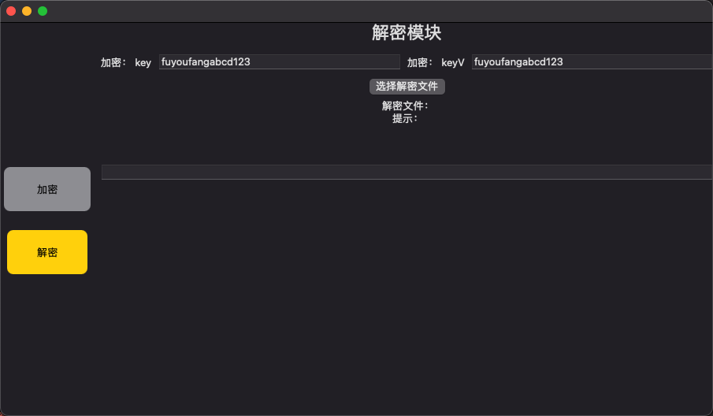

# SwiftyLoganTool

> 美团 Logan 日志文件使用 Swift / Object-C 解密的 Mac 程序。

美团 [Logan][Logan] 框架是高性能的日志框架。

美团提供了一套日志解决方案，但是我们的日志文件需要放到七牛上。想要查看日志内容，每次都需要将日志下载下来，然后解密，非常麻烦。于是开始尝试用写一个 Mac 程序可以实现直接查看七牛上的日志文件。

美团 [Logan][Logan] 的框架目前只提供的 Java 版的解密程序，所以第一步要做的就是怎么根据 Java 的解密程序写一套 Swift/Object-C 的解密程序。

## 项目信息

- 语言：Swift + Object
- UI: SwiftUI

实现的功能：

1. 利用 [Logan][Logan] 进行加密
2. Swift + Object-C 代码实现解密

界面 UI 如下：

| 解密模块 | 加密模块 | 
| :--: | :--: |
|  |  |

## 项目依赖

解密的过程中，用到了下面的库代码：
1. gzip 的解压过程使用到了 [LFCGzipUtility][LFCGzipUtility] 中的代码；
2. Base64 的解密过程使用到了 [GTMBase64][GTMBase64]；

另外还用到了 AES 加密、解密的过程中。

[Logan]:(https://github.com/Meituan-Dianping/Logan)
[LFCGzipUtility]:(https://github.com/levinXiao/LFCGzipUtility)
[GTMBase64]:(https://github.com/MxABC/GTMBase64)